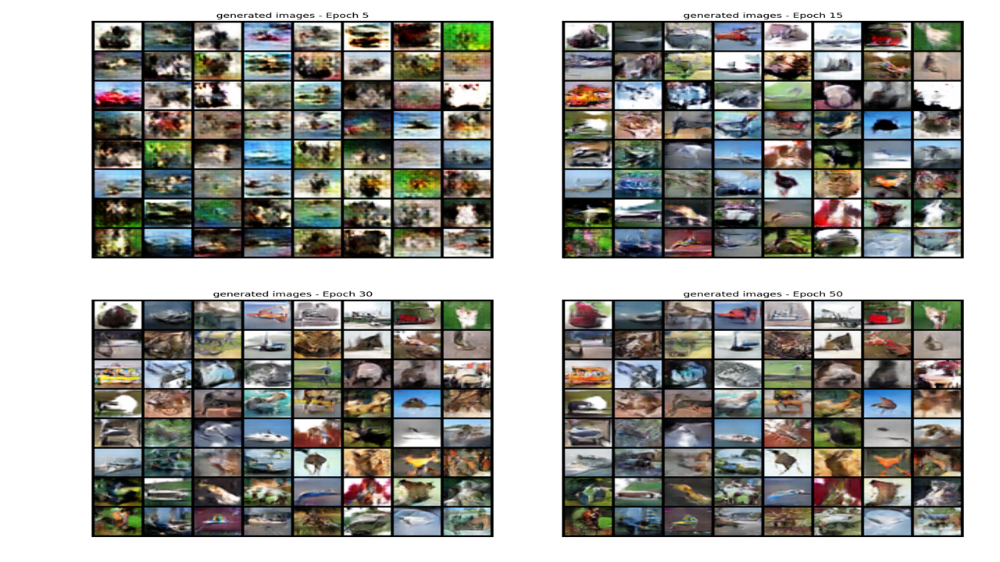
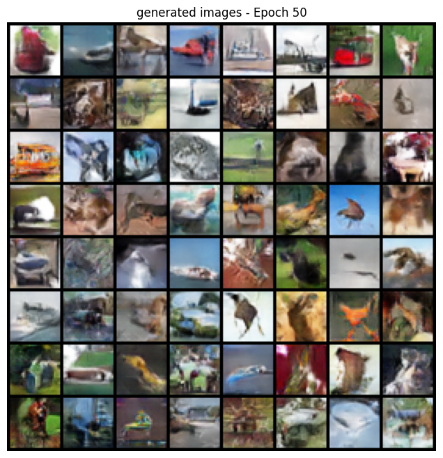

# DCGAN CIFAR-10 Image Generator

## Overview

This project implements a **Deep Convolutional Generative Adversarial Network (DCGAN)** to generate synthetic images inspired by the **CIFAR-10 dataset**. The model learns to produce realistic images through **adversarial training between a Generator and a Discriminator network**.

Due to limited local computational resources, the entire model training and experimentation process was performed using **Google Colab’s cloud GPU environment**, enabling efficient deep learning experimentation.

The project demonstrates how generative models can learn complex image distributions and progressively improve output quality across training epochs.

---

## Dataset

The model was trained using the **CIFAR-10 dataset**, which contains 60,000 low-resolution images across 10 object classes.

### Dataset Samples

Examples of images from the dataset used for training:

---

## Training Progress

During training, the Generator gradually learns to create images that resemble real data while the Discriminator improves its ability to detect fake images.

Below is the visual progression of generated images across training epochs.

---

## Final Generated Images (Epoch 50)

After training the DCGAN for 50 epochs, the Generator produces more structured and visually coherent images.

---

## Model Architecture

The model follows the **DCGAN architecture**, which uses deep convolutional layers for both Generator and Discriminator networks.

### Generator

* Transposed Convolution layers (ConvTranspose)
* Batch Normalization
* ReLU activation
* Tanh output layer

### Discriminator

* Convolutional layers
* LeakyReLU activation
* Batch Normalization
* Sigmoid output for real/fake classification

This adversarial setup allows the Generator to continuously improve as the Discriminator becomes more accurate.

---

## Technologies Used

* Python
* Deep Learning (GANs / DCGAN)
* Google Colab (Cloud GPU)
* NumPy
* Matplotlib
* CIFAR-10 Dataset

---

## Project Workflow

1. Load and preprocess the CIFAR-10 dataset
2. Build Generator and Discriminator architectures
3. Train the networks using adversarial learning
4. Monitor training progress through epoch outputs
5. Generate synthetic images using the trained Generator

---

## Results

The project demonstrates how **Generative Adversarial Networks can learn complex image distributions and generate realistic samples** from relatively small datasets.

Over the course of training:

* Noise gradually transforms into structured images
* Object-like patterns begin appearing
* Generated images become more coherent by the final epoch

---

## Future Improvements

* Train the model for more epochs to improve image clarity
* Experiment with **Conditional GANs (cGAN)** for class-specific generation
* Increase image resolution using **Progressive GAN techniques**
* Improve training stability with advanced GAN loss functions

---

## Author

**Sagarika Sahoo**
-GitHub: https://github.com/sagrika-dev-sys
-LinkedIn: https://linkedin.com/in/sagarikasahoo2006

This project was developed as part of an exploration into **Generative AI and Deep Learning**, focusing on understanding how adversarial learning enables machines to generate new visual content.
